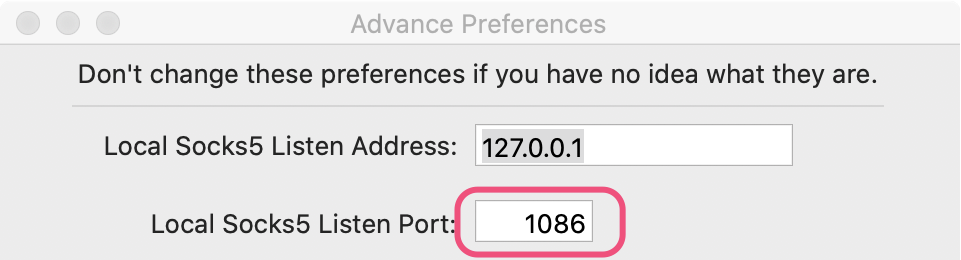
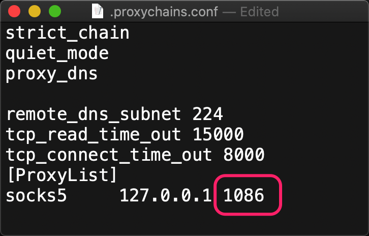

前提当然是你已经使用 ShadowSocks 小飞机✈️一类的工具成功科学上网啦～
### 安装 homebrew
```
/usr/bin/ruby -e "$(curl -fsSL https://raw.githubusercontent.com/Homebrew/install/master/install)"
```
### 安装 proxychains-ng
```
brew install proxychains-ng
```

### 配置proxychains-ng
* 安装 proxychains-ng
* 下载配置文件（如果下面的命令执行失败，那你就自己下载proxychains.conf，然后将其移动到 ~/.proxychains.conf）
```
curl -L https://raw.githubusercontent.com/FrankFang/dot-files/master/proxychains.conf > ~/.proxychains.conf
```
* 打开 ShadowSocks 里关于Socks5的设置页面，找到对应的端口号,比如下图的端口号是1086

修改.proxychains.conf文件里的端口号为上图的端口号

* 添加 bash alias，运行
```
touch ~/.bashrc; echo 'alias pc="proxychains4 -f ~/.proxychains.conf"' >> ~/.bashrc
```
* 编辑下.bash_profile，将source /.bashrc添加到最后一行去，保存
* pc git clone xxx 或者 pc brew install xxx --verbose，那么这个命令行就是翻墙的。
* 可使用
```
pc curl myip.ipip.net
```
测试是否翻墙成功～

### 如果经过以上步骤还不行，关闭 SIP
macOS 10.11 后下由于开启了 SIP（System Integrity Protection） 会导致命令行下 proxychains-ng 代理的模式失效，如果使用 proxychains-ng 这种简单的方法，就需要先关闭 SIP。
重启Mac，按住⌘ + R进入Recovery模式。 实用工具（Utilities）-> 终端（Terminal）。 输入命令csrutil disable运行。 重启进入系统后，终端里输入 csrutil status，结果中如果有 System Integrity Protection status:disabled. 则说明关闭成功。
```
csrutil status
System Integrity Protection status: disabled.
```
我们再试一次：
```
pc curl myip.ipip.net
[proxychains] config file found: /Users/cary/.proxychains.conf
[proxychains] preloading /usr/local/Cellar/proxychains-ng/4.14/lib/libproxychains4.dylib
当前 IP：103.152.221.201  来自于：中国 香港   joyso.app
```
